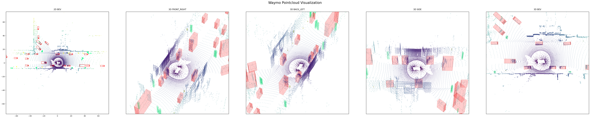

# Waymo_Dataset_Converter
A repo to convert waymo open dataset .tfrecords to simple padded .tfrecords for easy, batched reading

## Changelog
* (18. Jan 2023) Support to read camera and LiDAR segmentation, 2D/3D Detection are present. Visualizer for pointcloud for 2D/3D added in [visualizer.py](./visualizer.py)

